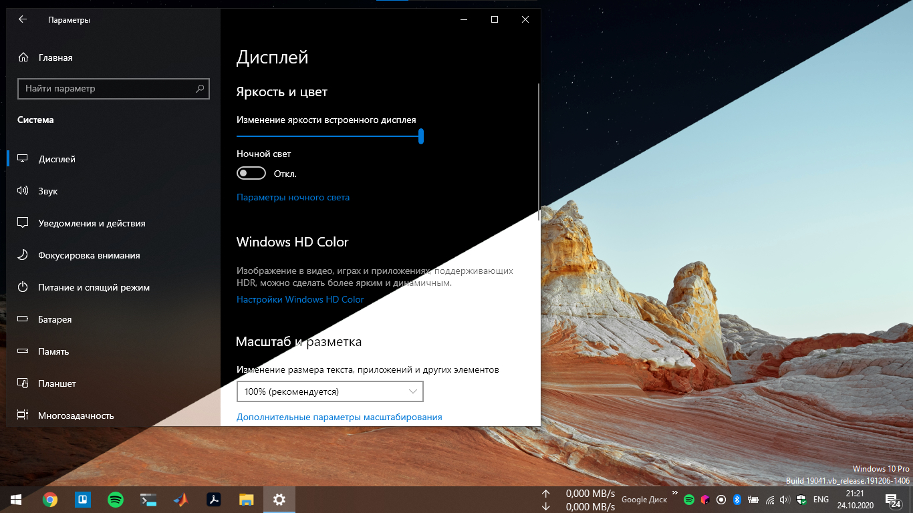

# AutoDarkLight
A pair of scripts for automatically (when installed properly) changing wallpaper and theme

## How to use
* Type the path to your ligh and dark wallpaper in the light.ps1 and dark.ps1
* Add the windows task for running the vbs scripts: light in the morning and dark in the evening